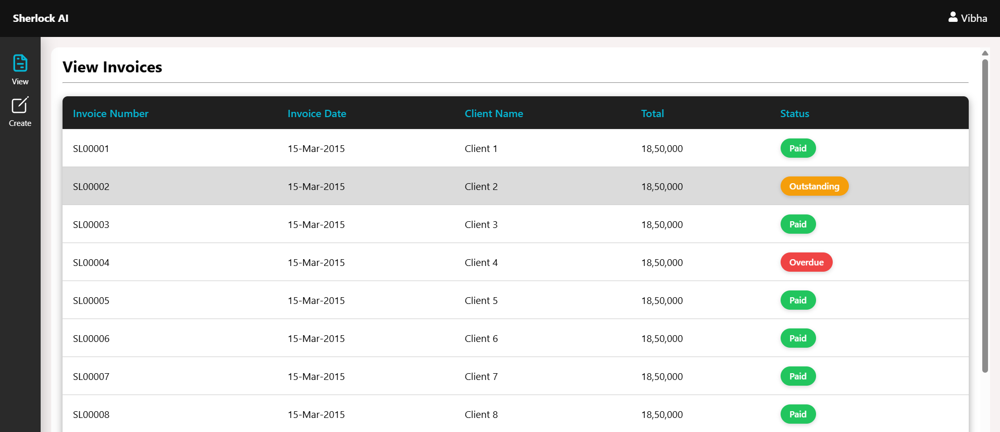
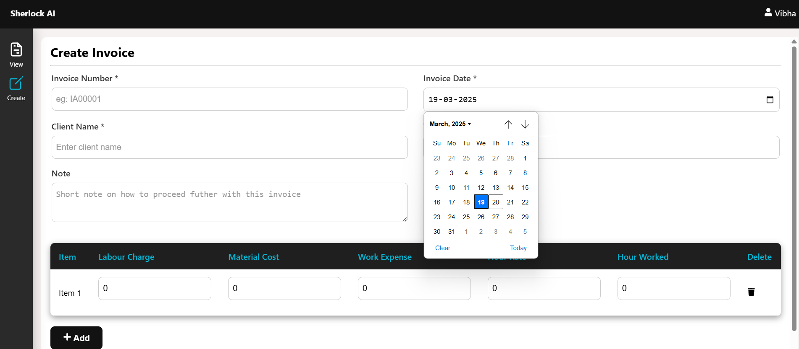
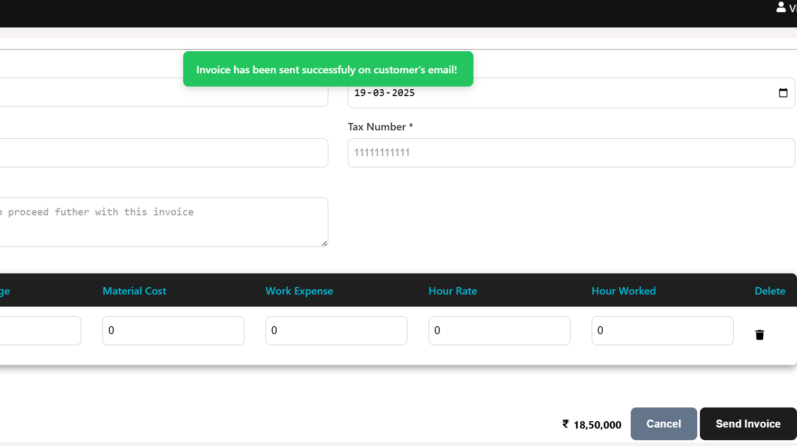

# 🧾 Invoice App - ReactJS Project

A **ReactJS** invoicing application that allows users to create professional invoices with line items, notes, etc. Built with `React`, `styled-components`, `Webpack`, and `Babel`.

👉 **Live Demo:** [https://vibha-invoice-app.netlify.app/create-invoices](https://vibha-invoice-app.netlify.app/create-invoices)

---

## ✅ Features Implemented

- **Create Invoice**
- **View Invoices with Paid, Outstanding and Due flag (Badge)**
- **Add Invoice Number:** Invoice Number.
- **Invoice Date:** Auto-filled with today’s date (editable)
- **Add Client Name:** Type Client Name.
- **Add Notes:** Instructions, payment details, etc.
- **Add Multiple Line Items:** Hours, work expenses, materials, labor, etc.
- **Delete Line Items:** To be implemented.
- **View Total Amount** Static for now
- **Reusable Components:** InputField, Alert, Button, LineItems, Badge, InvoiceTable
- **Mock Email Alert:** Displays success message on sending and the resetting state
- **Styled using Styled Components**
- **Auto-Dismiss Alert** after 3 seconds by default

---

## 🧠 Extra Added Features
- Invoice Due Date
- Polish UI

---

## 📸 Screenshots
### 🖼 **View Invoices with Paid, Outstanding and Due flag (Static)**

### 🖼 **Create Invoice with Line items table and Invoice due date**

### 🖼 **Send Invoice Success**

---

## 📦 Tech Stack
- **React 19**
- **Styled-Components 6**
- **React Icons**
- **React Router DOM 7**
- **Webpack 5 / Babel 7**

---